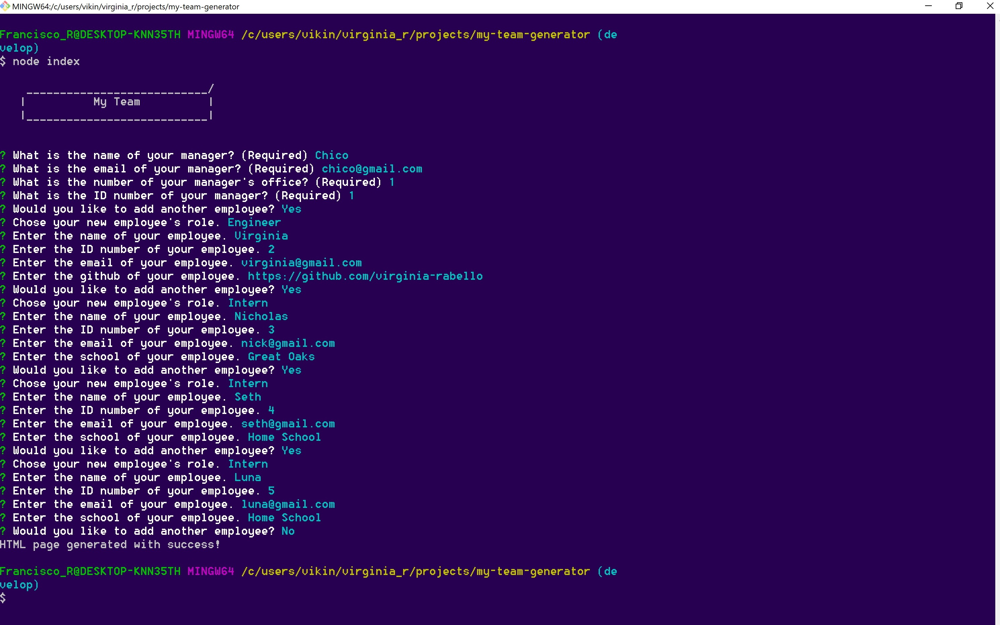
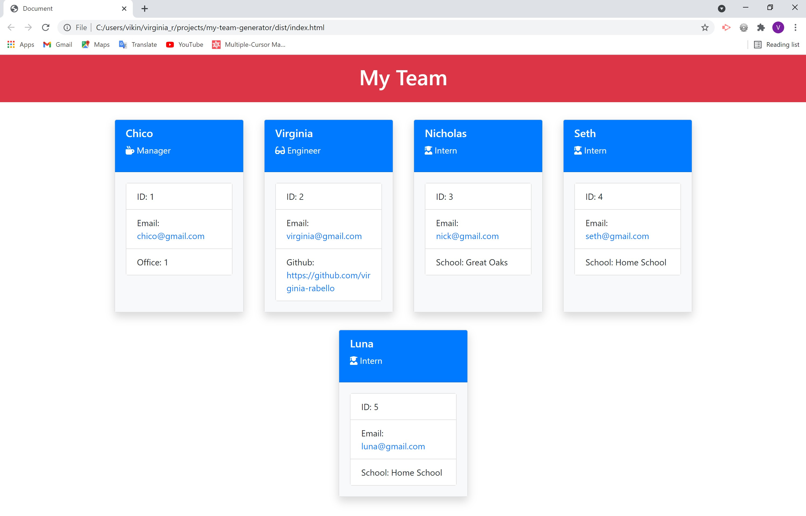

# My Team Generator
     

# Description

This is an app that requirer information from the user's inputs and generates an HTML page containing little cards for each member of a work team with their basic information.

# Table of Contents  
  
  * [Installation](#installation)
  * [Usage](#usage)
  * [License](#license)
   
  
# Installation
    
  Clone or download this repo, make sure you have npm packages installed, including 'inquirer package. Once you are all set just run node index in your Gitbash.

# Usage
    
  You have to answer the questions correctly. Information such as The emails of your employees will turn on links that once clicked will open your default email program to send an email, and Github information will turn into links that once clicked will open the Github repo in a new tab. It is very important to type your information correctly.

# License
  

  Copyright (c) 2021 Virginia Rabello.
  Licensed under the [GPL-3.0](https://opensource.org/licenses/GPL-3.0) license.
  
# Questions
  
  If you have any questions about this app please email me at virginia.rabello2107@gmail.com.
